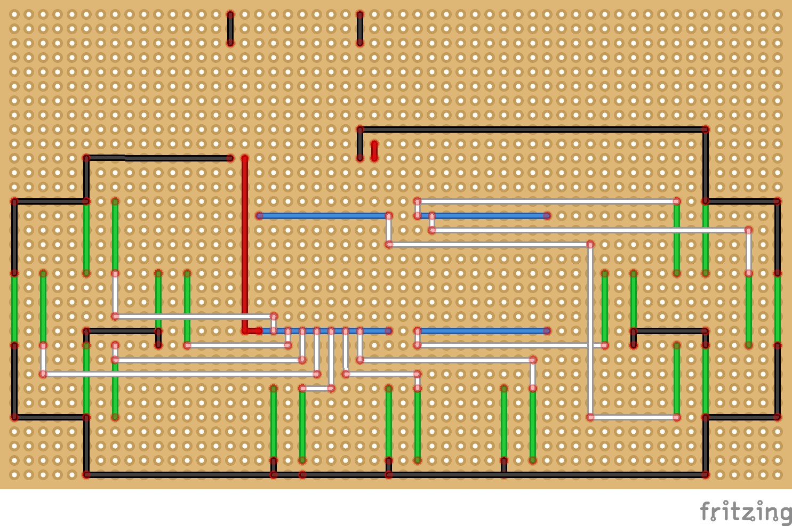

# ESPINO32-BLE-Robotics-Joystick

โปรเจกต์สร้างจอยสติ๊กไร้สายด้วยบอร์ด ESPino32 (ESP32) ที่ออกแบบมาเพื่อการใช้งานแบบ Hybrid สามารถสลับโหมดเป็น Bluetooth Gamepad สำหรับเล่นเกมบน PC หรือใช้ส่งคำสั่งควบคุมหุ่นยนต์ TurtleBot3 (ROS2) ผ่านเครือข่ายไร้สายได้โดยตรง

  

Dual-Mode Functionality: รองรับทั้งโหมด BLE Gamepad และโหมดควบคุมหุ่นยนต์ผ่าน Wi-Fi (ROS2)

Custom Hardware Design: บัดกรีวงจรด้วยมือบนแผ่นไข่ปลา (Perfboard) ขนาด 9x15 cm พร้อมเคสอะคริลิคใส

Power Management: มีระบบจ่ายไฟในตัวด้วยแบตเตอรี่ 18650 พร้อมโมดูลชาร์จ ทำให้ใช้งานแบบไร้สายได้ 100%

Ergonomic Layout: ออกแบบตำแหน่งปุ่มกด WASD และปุ่มฟังก์ชันให้ถนัดมือเหมือนจอยเกมมาตรฐาน

 
ทำ perfboard สำหรับให้เสียบ บอร์ด ESPINO32 ลงไปได้

  
  

ออกแบบลายวงจรด้วยโปรแกรม Fritzing

  

